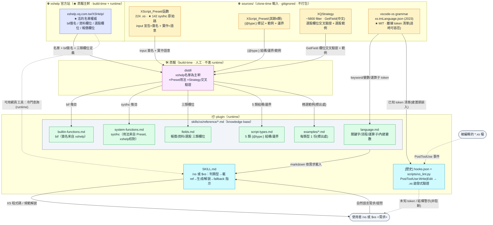

# xs_helper — Architecture (FBD)

> 本檔為 **常駐架構文件**，含兩階段 FBD：
>
> - **Phase 1（模組層）**：coding 前畫，驗證模組劃分完整、資料流閉合、無循環依賴。
> - **Phase 2（函式層）**：coding 後畫，標共享 XS Skill runtime（Claude Code `/xs`、Codex `$xs`）的程序步驟與 `xs_lint.py`
>   的 public function 真實簽名/型別/資料流，供未來上手者參考。
>
> 對應 SPEC：[SPEC.md](SPEC.md) 的 Project Structure / Features。

**狀態（v0.3.0）：** `skills/xs/` 是唯一 runtime 知識來源，Claude Code 以 `/xs`、Codex 以 `$xs` 使用；兩端也可依 skill description 自動載入。`PostToolUse: Write|Edit → xs_lint.py` 的**自動 hook 已於 v0.2.0 移除**（見 [CHANGELOG](../CHANGELOG.md) / [SPEC F4](SPEC.md)）。`scripts/xs_lint.py` 保留為 benchmark 與手動檢查工具；下方 Hook 旁支/節點只保留為移除前的歷史設計記錄。

## 雙平台封裝與安裝

```text
xs_helper/
├── .claude-plugin/              # Claude Code manifest + marketplace
├── .codex-plugin/plugin.json    # Codex 原生 manifest
├── .agents/plugins/marketplace.json
└── skills/xs/                   # plugin 共用來源，也是 Codex IDE 可獨立安裝的 skill
```

Claude Code：

```text
/plugin marketplace add Benjamin-Teng/xs_helper
/plugin install xs-helper@xs-tools
/reload-plugins
```

安裝後以 `/xs <需求>` 明確觸發。

Codex surface 支援：

| 使用介面 | 安裝產物 | 入口 |
| --- | --- | --- |
| VS Code／Codex IDE（推薦） | 獨立 `xs` skill | 對話框 `$skill-installer` |
| Codex CLI 對話介面 | 完整 plugin | 註冊 marketplace 後輸入 `/plugins` |
| 支援 Plugins Directory 的桌面介面 | 完整 plugin | Plugins Directory |

IDE extension 目前不支援完整 plugin，但 `xs-helper` 現階段沒有 MCP、connector 或 hook，因此獨立 skill 可取得目前全部功能。在 VS Code／Codex IDE 對話框輸入：

```text
$skill-installer 請從 https://github.com/Benjamin-Teng/xs_helper/tree/main/skills/xs 安裝 xs skill
```

核准下載後開新對話；若 `$xs` 未出現，重新載入 VS Code。

Codex CLI 對話介面先註冊 marketplace：

```shell
codex plugin marketplace add Benjamin-Teng/xs_helper
```

再啟動 `codex`、輸入 `/plugins`，從 `xs-tools` 安裝 `xs-helper`。終端機進階安裝可直接執行：

```shell
codex plugin marketplace add Benjamin-Teng/xs_helper
codex plugin add xs-helper@xs-tools
```

安裝後開新 session，以 `$xs <需求>` 明確觸發。兩種封裝與 IDE 獨立安裝都使用根目錄的 `skills/xs/`，不複製 reference。

## 四來源的角色分層（探勘＋線上實證）

知識**不是**「一來源對一檔」，而是分層互補。實測後 **xshelp 為蒸餾期主幹**（最新、最全），grammar 退居離線對照與 Hook token 清單。

| 角色 | xshelp 官方站 | XScript_Preset | grammar (vscode-xs) | XQStrategy |
| ---- | ------------ | -------------- | ------------------- | ---------- |
| **名單**（token 完整清單） | ★ 活的權威（最新、最全） | — | 2023 快照（已落後、僅離線對照） | — |
| **bif 內建函數簽名** | ★ 唯一來源（build-time 抓） | ✗ 0 個有源 | 只確認名字 | — |
| **sysfnc 系統函數用法** | 補/校對 | ★ 142/143 有原始碼（簽名+語意） | 對照清單 | — |
| **資料欄位**（基本/籌碼/事件…） | ★ 清單+定義 | — | — | — |
| **選股欄位**（中文，498+ 種） | ★ 清單+定義 | — | — | `GetField()` 交叉驗證 |
| **報價欄位** `q_*` | ★ 清單+定義 | — | 有名單 | — |
| **`{@type:}` 5 類結構/邊界** | — | ★ | — | — |
| **範例**（每類型 1 份） | — | ★ Preset | — | ★ 選股範例 |
| **Hook 離線 token 清單** | — | — | ★（建置期嵌入，過時可容忍：寧放行不誤殺） | — |

> ⚠️ 關鍵認知校正：
>
> 1. **xshelp 是必要參考、蒸餾主幹**，身兼 build-time（抓名單/bif簽名/欄位定義）與 runtime（冷門 fallback）。
> 2. **grammar 是封閉但過時的 2023 快照**——適合當 Hook 的離線 token 清單（過時沒關係，目的是不誤殺），不再當名單權威。
> 3. URL 規律：清單 `/XSHelp/lists?a=<代碼>`、細節 `/XSHelp/?HelpName=<名稱>&group=<代碼>`（中文 URL-encode）。

## Phase 1 — 模組層資料流



## 閉合性檢查

| 檢查項 | 結論 |
|--------|------|
| 名單完整性來源？ | ✅ xshelp（活的權威）；grammar 僅離線對照 |
| bif 簽名有來源？ | ✅ xshelp build-time 抓（細節頁含簽名/參數/回傳/範例，已實測） |
| sysfnc 用法有來源？ | ✅ 142/143 來自 Preset/函數 原始碼，xshelp 校對 |
| 三類欄位有來源？ | ✅ xshelp 清單（報價/資料/選股），選股欄位再以 Strategy GetField 交叉驗證 |
| SKILL.md 知識來源閉合？ | ✅ 離線走 `reference/*`，冷門走 `xshelp` fallback |
| Hook token 來源？ | ✅ grammar（建置期嵌入，runtime 不依賴 sources/） |
| 有無循環依賴？ | ✅ 無，資料單向：xshelp/sources→distill→reference→skill |
| sources/ 是否進 runtime？ | ❌ 僅 build-time 輸入，gitignored、不打包（授權+體積） |

## Phase 2 — 函式層資料流

目前只有一條自動載入路徑：共享 **XS Skill**（Claude Code `/xs`、Codex `$xs`；程序為判類型 → 選擇性載 reference → 產出）。圖中的 `xs_lint.py` PostToolUse 管線是 v0.2.0 移除前的歷史設計；獨立 lint 腳本仍可手動執行，且與 skill 不互相呼叫。節點 label 標真實簽名與型別，邊標傳遞的資料。

```mermaid
flowchart TD
    %% ===== I/O 邊界 =====
    USER(["使用者 /xs 或 $xs &lt;需求 / 提問&gt;"])
    XSFILE(["*.xs 檔被 Write / Edit"])
    HOOKCFG["hooks.json<br/>PostToolUse: Write / Edit<br/>→ python xs_lint.py"]

    %% ===== 共享 XS Skill runtime（SKILL.md 程序）=====
    subgraph SKILLRT["📦 XS Skill runtime（/xs 或 $xs）"]
        S1["① 判定腳本類型<br/>autotrade / function / indicator / filter / sensor<br/>★ 不明確→反問；選股再問市場"]
        S2["② 選擇性載入 reference<br/>★ 只讀需要的檔，不一次全載"]
        S3["③ 產出<br/>腳本生成(帶 {@type:}) 或 規範問答(簽名+範例)"]
    end

    %% ===== knowledge base（reference/*.md，資料）=====
    subgraph REF["skills/xs/reference/*.md（knowledge base · 資料）"]
        LANG["language.md<br/>關鍵字 / 流程 / 運算子 / 內建變數"]
        BIF["builtin-functions.md<br/>bif 8 類 · 簽名+語意"]
        SYS["system-functions.md<br/>224 sysfnc · 14 分類"]
        FIELDS["fields.md<br/>報價 q_* / 資料 T* / 選股 F*"]
        TYPES["script-types.md<br/>5 類 {@type:} 結構 / 邊界 / 回傳機制"]
        EX["examples/*.md ×5<br/>每類型 1 份(標出處)"]
    end

    subgraph WEB["🌐 F3 Fallback（runtime · 冷門查詢）"]
        XSHELP["xshelp.xq.com.tw/XSHelp<br/>lists?a=&lt;代碼&gt; / ?HelpName=&lt;名&gt;"]
    end

    %% ===== xs_lint.py 函式管線 =====
    subgraph LINT["🛠️ scripts/xs_lint.py（PostToolUse 管線 · stdlib · 恆 exit 0）"]
        MAIN["main() → int<br/>★ orchestrator · 恆回 0(非阻斷)"]
        READEV["read_event() → dict<br/>讀 stdin 事件 JSON;失敗回 {}"]
        GETPATH["get_target_path(event: dict) → str | None<br/>★ 非 *.xs 回 None → 靜默"]
        STRIP["strip_comments(src: str) → str<br/>去區塊/行註解 + 字串字面量"]
        CHKSTRUCT["check_structure(code: str) → list[str]<br/>begin/end 配對；if 缺 then"]
        CHKTOK["check_unknown_tokens(code: str) → list[str]<br/>抓 識別字( 比對；去尾數正規化"]
        KTOK["KNOWN_TOKENS: frozenset[str]<br/>604 token(grammar 2023 ∪ Preset 215 sysfnc ∪ xshelp bif · 小寫)"]
    end

    subgraph TEST["🧪 tests/test_xs_lint.py（17 stdlib 測試）"]
        T["StripComments / CheckStructure /<br/>CheckUnknownTokens / GetTargetPath"]
    end

    %% ----- /xs 資料流（實線：傳什麼）-----
    USER -->|"自然語言需求 / 提問"| S1
    S1 -->|"腳本類型(+市場)"| S2
    LANG -->|"markdown 知識"| S2
    BIF -->|"markdown 知識"| S2
    SYS -->|"markdown 知識"| S2
    FIELDS -->|"markdown 知識"| S2
    TYPES -->|"markdown 知識"| S2
    EX -->|"markdown 知識"| S2
    S2 -->|"已載入的 reference 上下文"| S3
    S3 -->|"XS 程式碼 / 規範解說"| USER
    XSHELP -.->|"可用網頁工具：冷門 token(標線上結果)"| S3

    %% ----- xs_lint 資料流（實線：傳什麼 / 虛線：事件）-----
    XSFILE -.->|"觸發 PostToolUse 事件"| HOOKCFG
    HOOKCFG -->|"event JSON 經 stdin"| MAIN
    MAIN --> READEV
    READEV -->|"event: dict"| GETPATH
    GETPATH -->|"path: str(*.xs) 或 None"| MAIN
    MAIN -->|"raw: str(utf-8-sig 讀檔)"| STRIP
    STRIP -->|"code: str(去註解 / 字串)"| CHKSTRUCT
    STRIP -->|"code: str"| CHKTOK
    KTOK -->|"已知 token 比對集"| CHKTOK
    CHKSTRUCT -->|"list[str] 結構警示"| MAIN
    CHKTOK -->|"list[str] 未知 token 警示"| MAIN
    MAIN -.->|"⚠️ 警示 → stderr(非阻斷)"| USER

    %% ----- 測試消費關係（虛線）-----
    T -.->|"unittest 驗證"| STRIP
    T -.->|"unittest 驗證"| CHKSTRUCT
    T -.->|"unittest 驗證"| CHKTOK
    T -.->|"unittest 驗證"| GETPATH

    classDef io fill:#f1f5f9,stroke:#64748b,color:#1f2937;
    classDef skill fill:#cffafe,stroke:#0891b2,color:#1f2937;
    classDef ref fill:#dcfce7,stroke:#16a34a,color:#1f2937;
    classDef web fill:#e0e7ff,stroke:#4f46e5,color:#1f2937;
    classDef lint fill:#e0f2fe,stroke:#0284c7,color:#1f2937;
    classDef data fill:#fef3c7,stroke:#d97706,color:#1f2937;
    classDef test fill:#fae8ff,stroke:#a21caf,color:#1f2937;

    class USER,XSFILE,HOOKCFG io;
    class S1,S2,S3 skill;
    class LANG,BIF,SYS,FIELDS,TYPES,EX ref;
    class XSHELP web;
    class MAIN,READEV,GETPATH,STRIP,CHKSTRUCT,CHKTOK lint;
    class KTOK data;
    class T test;
```



### Phase 2 閉合性檢查

| 檢查項 | 結論 |
|--------|------|
| 每個 public function 都有節點？ | ✅ `xs_lint.py` 6 函式（main/read_event/get_target_path/strip_comments/check_structure/check_unknown_tokens）全收，標真實簽名 |
| 節點 label 有真實型別？ | ✅ `→ dict` / `→ str \| None` / `→ list[str]` / `→ int` 皆為原始碼簽名 |
| 資料流閉合（lint）？ | ✅ stdin event → dict → path → raw → code →(struct+token)→ warnings → stderr，單向無回環 |
| 資料流閉合（skill）？ | ✅ 需求 → 類型 → 選擇性載 reference → 產出；冷門走 xshelp 虛線 fallback |
| 兩 runtime 是否耦合？ | ❌ 不互呼叫；僅共用 grammar 事實（KNOWN_TOKENS 嵌入 vs Hook 離線清單） |
| 測試覆蓋公開函式？ | ✅ strip_comments / check_structure / check_unknown_tokens / get_target_path 皆有 unittest（虛線消費） |

## 與 SPEC 的落差 / 校正

- **校正 1**：知識來源是**分層互補**不是一對一。
- **校正 2**：xshelp 不只 runtime fallback，**蒸餾期就是主幹**（抓名單、123+ bif 簽名、三類欄位定義）→ build-time 也依賴網路（一次性）。
- **校正 3（本次新增）**：grammar 是 **2023 快照、已落後**（xshelp 一般函數清單含多個 grammar 沒有的函數如 `CallFunction`/`GetInfo`/`IsLastBar`/`PlotFill`/`SetAlign`）。故 **xshelp 升為名單權威，grammar 降為 Hook 離線 token 清單**（過時可容忍：寧放行不誤殺）。
- 線上實測已通過：導覽目錄、清單頁（`TBASIC` 資料欄位/基本、`GENERALFUNC`）、細節頁（`CurrentBar` 簽名+範例）皆可由網頁工具取得。
- 無新增模組需求；模組劃分維持 SPEC 不變。
